# 60 Must-Have Free and Open-Source Linux Tools for 2026

> **Source:** [TecMint](https://www.tecmint.com/best-free-open-source-software/) — by Gabriel Cánepa

---

## 📂 Terminal & Utilities

### 1. Tmux

> Tmux is an open-source terminal multiplexer that lets you run multiple terminal sessions inside a single window – almost like having tabs or panes ins.

🔗 [Tmux](https://github.com/tmux/tmux) | [detach a session](https://www.tecmint.com/run-linux-command-in-background/)

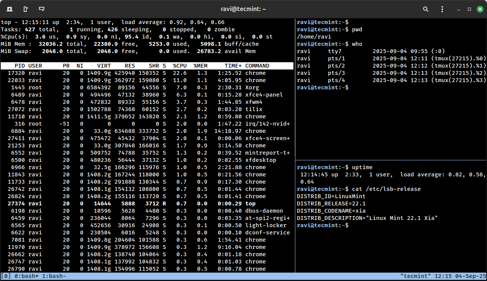

---

## 📂 Security

### 2. Bleachbit

> Bleach Bit is often compared to C Cleaner , but in many ways, it goes further and helps you reclaim valuable disk space by removing temporary files , sy.

🔗 [CCleaner](https://www.tecmint.com/ccleaner-alternatives-for-ubuntu/) | [removing temporary files](https://www.tecmint.com/find-and-delete-duplicate-files-in-linux/) | [BleachBit](https://www.tecmint.com/bleachbit-disk-space-cleaner-for-linux/)

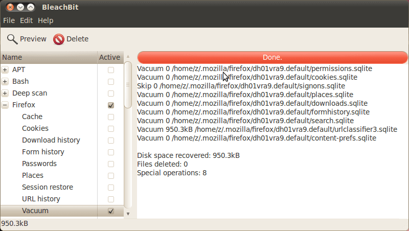

---

### 3. KeePass

> With so many programs, websites, and services demanding logins these days, it’s almost impossible to remember every password without some help, that’s.

🔗 [KeePass](https://keepass.info/)

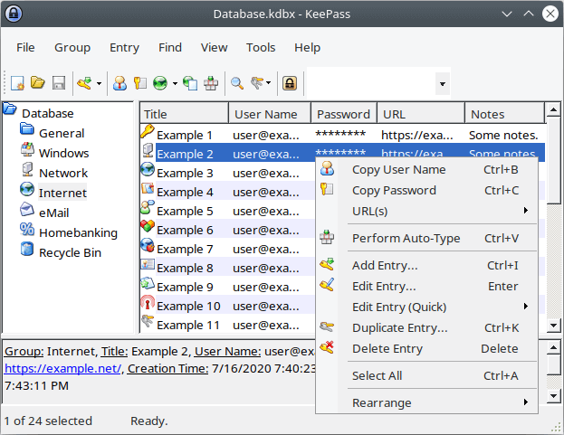

---

## 📂 PDF Tools

### 4. PDF Mix Tool

> I don’t often edit PDF files, but when I do, I usually use PDF Mix Tool , which is a simple and lightweight open-source program that makes it possible.

🔗 [PDF Mix Tool](https://scarpetta.eu/pdfmixtool/) | [best pdf editors for Linux](https://www.tecmint.com/pdf-editors-linux/)

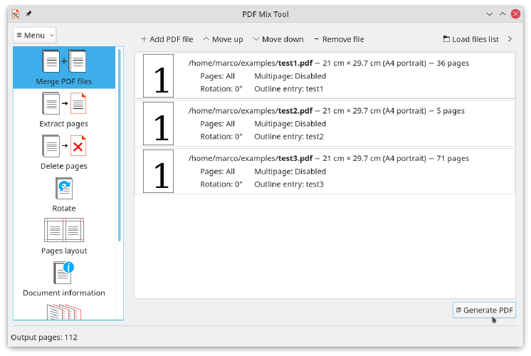

---

### 5. Master PDF Editor (Paid)

> Master PDF Editor is an easy-to-use PDF editing tool for working with PDF documents that comes with powerful multi-purpose functionality.

🔗 [Master PDF Editor](https://code-industry.net/masterpdfeditor/)

.png)

---

## 📂 Graphics & Design

### 6. LibreOffice Draw

> Libre Office Draw is an application that is inbuilt into the Libre Office suite that enables you to create anything from an easy sketch to a complex one.

🔗 [LibreOffice Draw](https://www.libreoffice.org/discover/draw/)

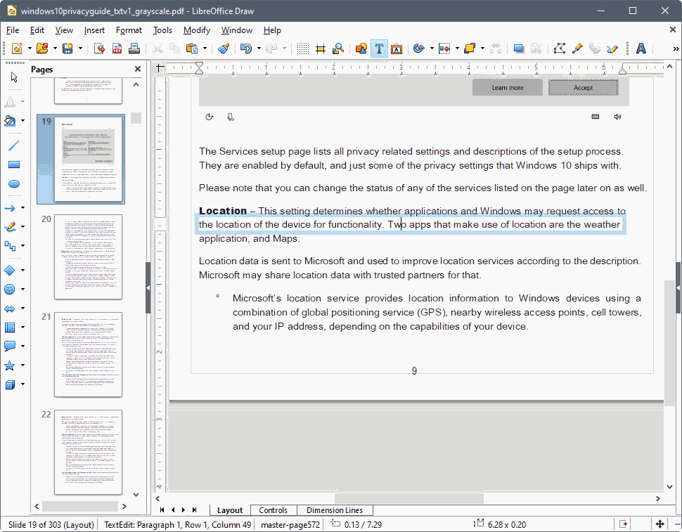

---

## 📂 Installer

### 7. Calamares

> Calamares is a universal, distribution-independent installer that makes installing Linux fast and painless.

🔗 [Calamares](https://calamares.io/) | [many popular Linux distributions](https://www.tecmint.com/top-most-popular-linux-distributions/)

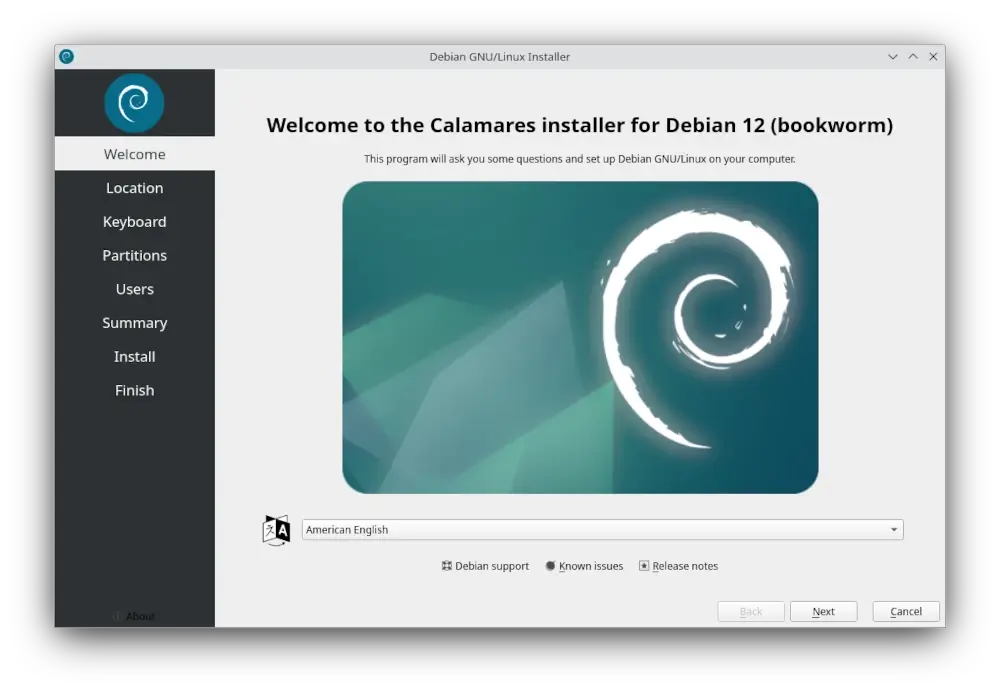

---

## 📂 Other

### 8. Dracut

> Dracut is a modern tool for generating the initramfs (initial RAM filesystem) used during the Linux boot process .

🔗 [Dracut](https://github.com/dracutdevs/dracut) | [Linux boot process](https://www.tecmint.com/linux-boot-process/)

---

## 📂 Security

### 9. OSQuery

> As its name suggests, OS Query provides access to real-time system information in the form of tables and events that can be queried using SQL-like synt.

🔗 [OSQuery](https://osquery.io) | [osquery](https://www.tecmint.com/monitor-linux-server-security-with-osquery/)

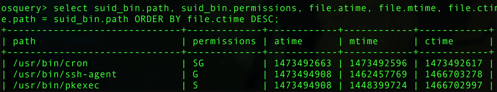

---

## 📂 Video Editing & Conversion

### 10. OBS Studio

> OBS Studio has become the go-to choice for screen recording and live streaming on Linux, as it is powerful, flexible, and trusted by everyone from cas.

🔗 [OBS Studio](https://obsproject.com/)

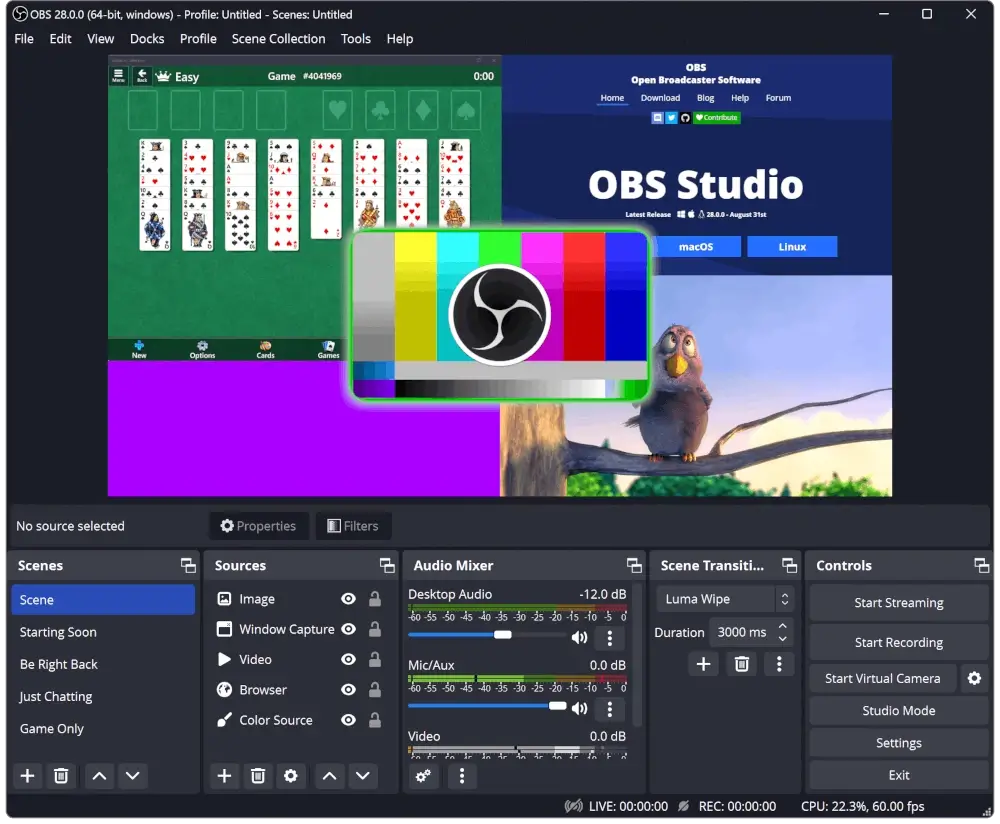

---

## 📂 Screen Recording

### 11. Kazam

> Kazam had a quiet period after development stalled in 2014, but it’s back with a vengeance in the form of Kazam 2.

🔗 [Kazam 2.0](https://github.com/henrywoo/kazam)

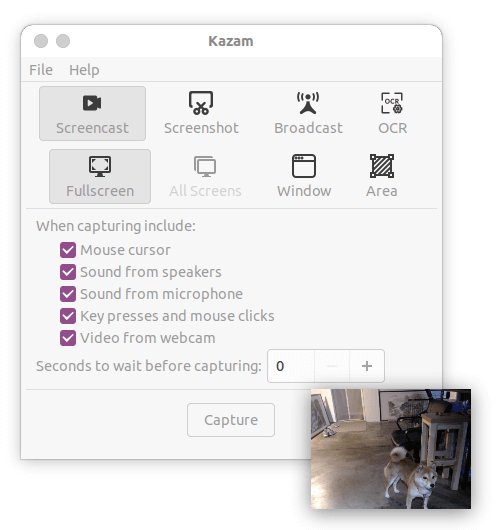

---

### 12. VokoscreenNG

> VokoscreenNG offers a few more features than Kazam while still keeping things straightforward, making it a great middle ground for everyday screencast.

🔗 [VokoscreenNG](https://github.com/vkohaupt/vokoscreenNG)

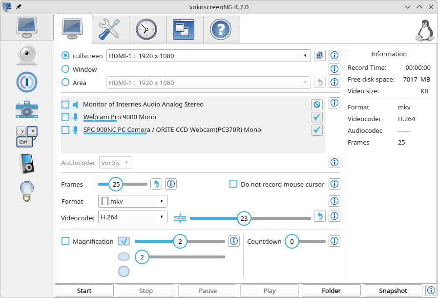

---

### 13. Kooha

> If you’re running Wayland and need something simpler than OBS Studio , Kooha is a lightweight screen recorder designed specifically for modern GNOME d.

🔗 [Kooha](https://github.com/SeaDve/Kooha)

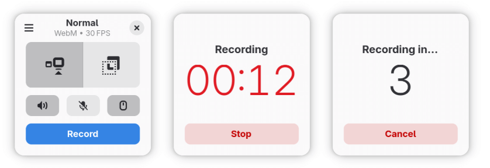

---

## 📂 Graphics & Design

### 14. GIMP

> GIMP (GNU Image Manipulation Program) is a multi-platform, free, and open-source photo editing software used for image manipulation and image editing,.

🔗 [GIMP](https://www.gimp.org/) | [photo editing software](https://www.tecmint.com/best-image-photo-editors-for-linux/)

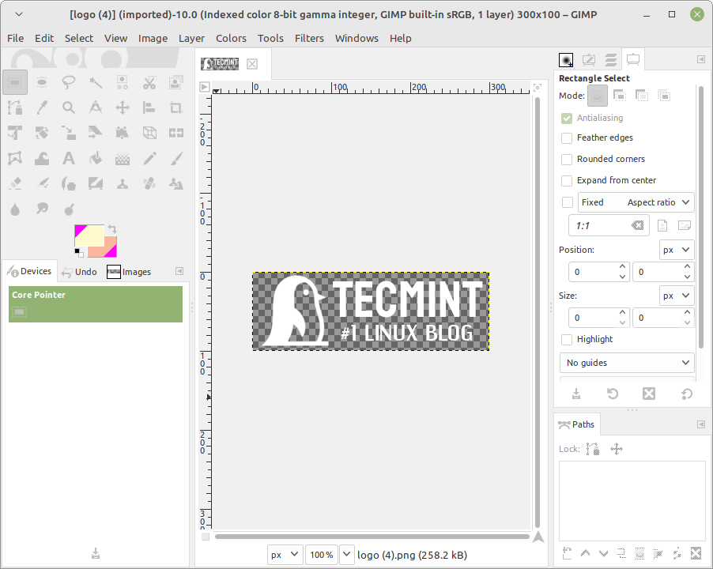

---

### 15. Blender

> If you are into game development, video editing , or 3D modeling, I am sure you must have already heard about this tool.

🔗 [video editing](https://www.tecmint.com/best-free-video-editing-softwares-for-linux/) | [Blender](https://www.blender.org/)

---

## 📂 3D Modeling & CAD

### 16. FreeCAD

> FreeCAD is a general-purpose 3D Computer-Aided Design program fit for use in engineering and architecture.

🔗 [FreeCAD](https://www.freecadweb.org/)

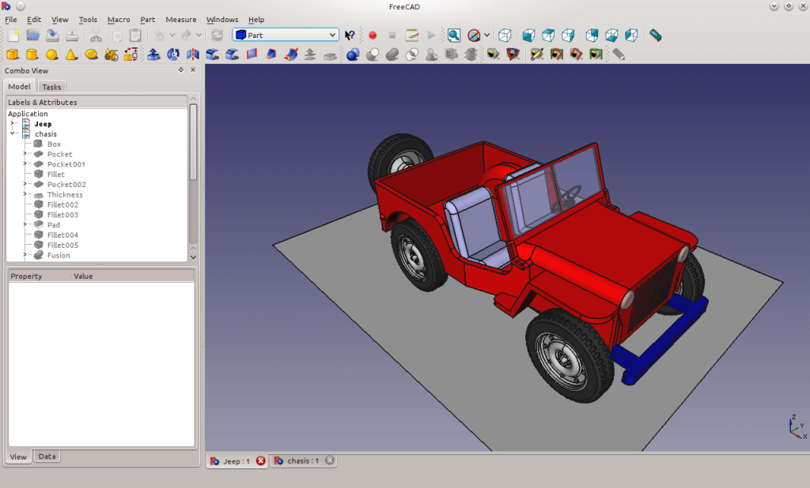

---

## 📂 Graphics & Design

### 17. Inkscape

> Inkscape is one of the most popular open-source tools for creating and editing vector graphics.

🔗 [Inkscape](https://inkscape.org/)

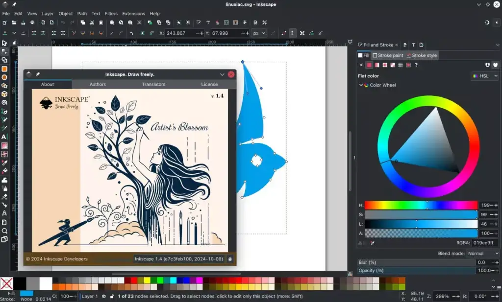

---

## 📂 Video Editing & Conversion

### 18. OpenShot

> Open Shot is a FOSS video editor for Linux that can help you create “the film you have always dreamed of” (in the words of its developers) with your ho.

🔗 [OpenShot](https://www.openshot.org/)

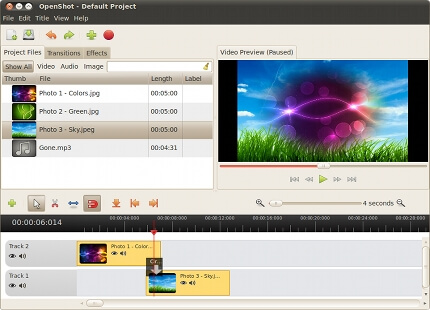

---

### 19. Shotcut

> Shotcut is one of the best free and open-source video editors available for Linux today.

🔗 [Shotcut](https://www.shotcut.org/)

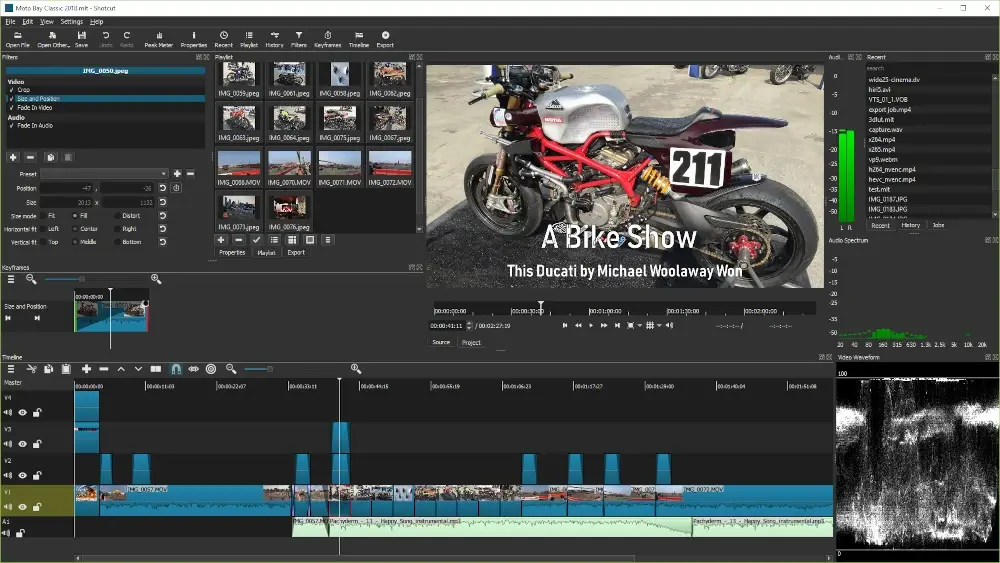

---

### 20. DVDStyler

> DVD Styler is a cross-platform, FOSS DVD authoring tool that allows you to create nice-looking and professional DV Ds with your video and image files.

🔗 [DVDStyler](http://www.dvdstyler.org/en/)

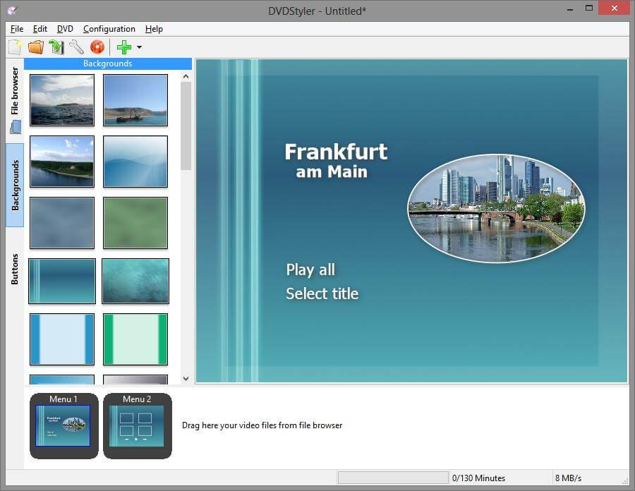

---

## 📂 Multimedia

### 21. VLC Media Player

> VLC Media Player is the go-to choice for anyone who wants a reliable, lightweight, and versatile media player that supports virtually every audio and .

🔗 [VLC Media Player](https://www.videolan.org/vlc/)

---

## 📂 Audio & Music

### 22. Audacity

> Audacity is an easy-to-use, multi-track audio editor and recorder for podcasters, musicians, and hobbyists who need a reliable tool to record, cut, an.

🔗 [Audacity](https://www.audacityteam.org/)

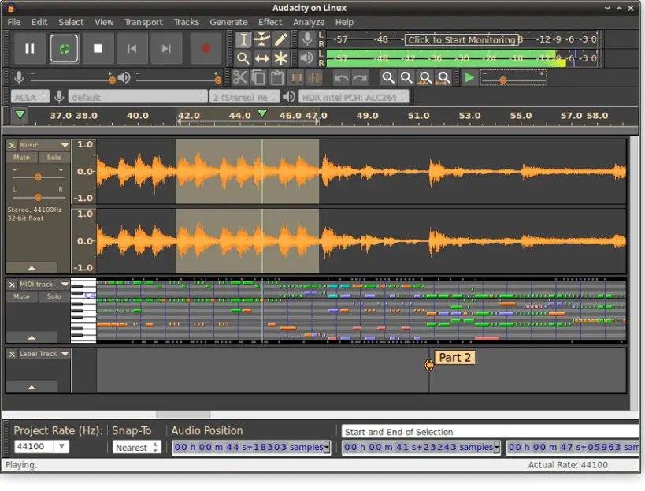

---

### 23. TuxGuitar

> If you’re like me and music (especially the guitar) is one of your passions, you’ll love this Tux Guitar program, which will let you edit and play guit.

🔗 [TuxGuitar](https://github.com/helge17/tuxguitar)

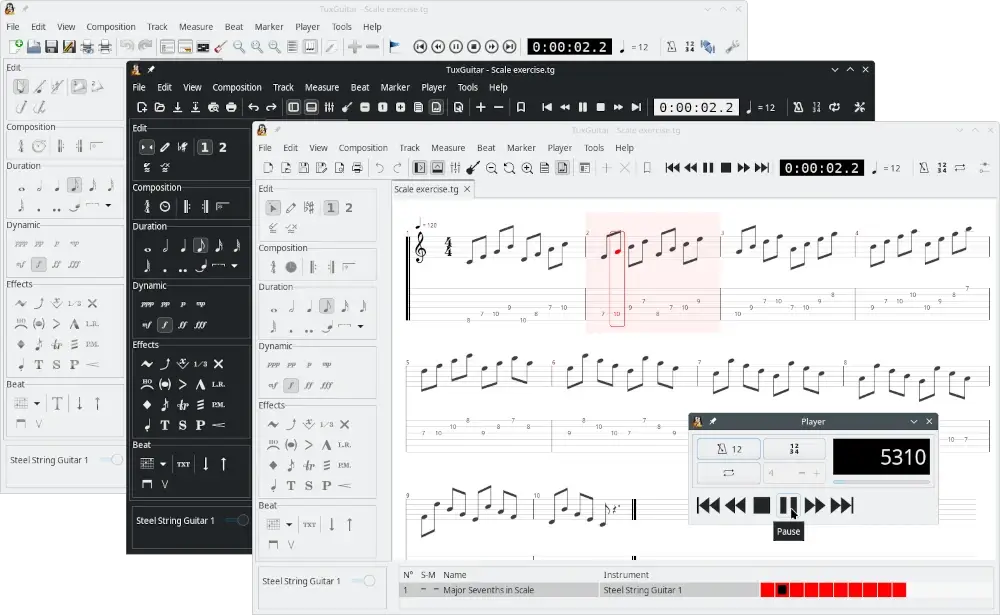

---

### 24. MuseScore

> Muse Score is an open-source and free professional music notation application that is used to create, play, and print beautiful sheet music using an ea.

🔗 [MuseScore](https://musescore.org/en)

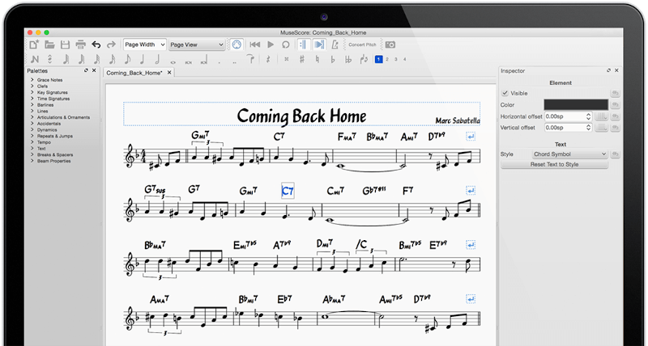

---

## 📂 Science & Simulation

### 25. Celestia

> Because even system administrators and developers need a little distraction, you can use Celestia (a free 3D astronomy program) to navigate the univer.

🔗 [Celestia](https://celestiaproject.space/)

---

### 26. FlightGear

> Flight Gear is an awesome open-source flight simulator that goes far beyond just being a game.

🔗 [FlightGear](https://www.flightgear.org/)

---

## 📂 Development & IDEs

### 27. Visual Studio Code

> Visual Studio Code is a free source code editor developed by Microsoft that has reached a significant level of popularity among web and cloud develope.

🔗 [Visual Studio Code](https://code.visualstudio.com/) | [run terminal commands](https://www.tecmint.com/essential-linux-commands/)

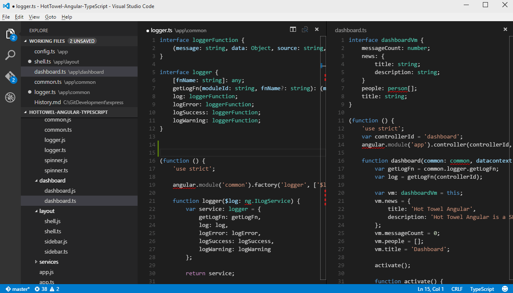

---

### 28. CodeMirror

> Code Mirror is a highly versatile Java Script-based text editor that runs directly in your web browser, which comes with syntax highlighting for over 10.

🔗 [CodeMirror](https://codemirror.net/)

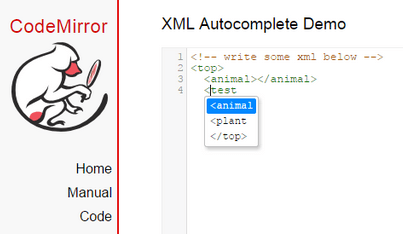

---

### 29. Fyne

> Fyne is a modern, open-source GUI toolkit for the Go programming language that lets you build cross-platform desktop and mobile applications with ease.

🔗 [Fyne](https://fyne.io/)

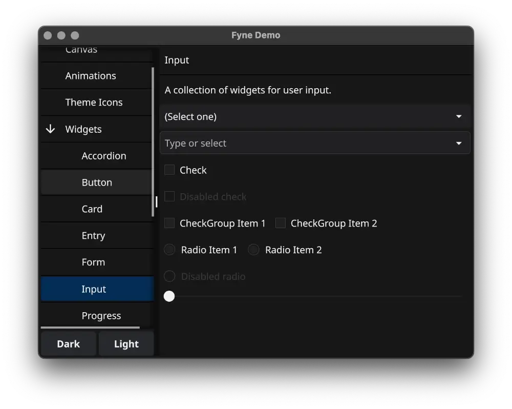

---

## 📂 AI & CLI Tools

### 30. Gemini CLI

> Gemini CLI is a free, open-source command-line tool that brings the power of Google’s Gemini AI directly into your terminal for a wide range of tasks:.

🔗 [Gemini CLI](https://github.com/google-gemini/gemini-cli)

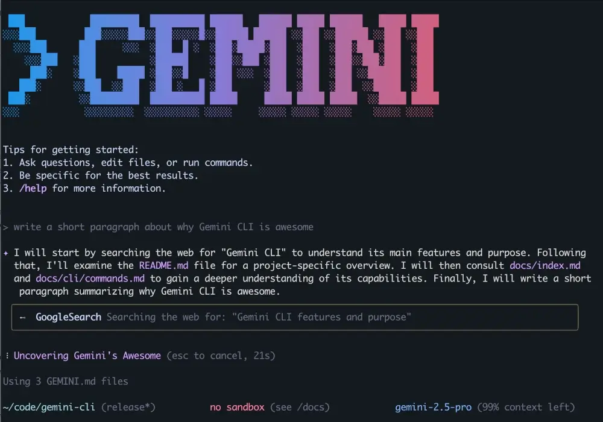

---

## 📂 Other

### 31. Ollama

> If you’ve been curious about running ChatGPT-like models on your own computer, Ollama is where you should start – it is a command-line tool that makes.

🔗 [ChatGPT-like models](https://www.tecmint.com/open-source-chatgpt-alternatives/) | [Ollama](https://github.com/ollama/ollama)

---

### 32. Jan

> Jan is an open-source alternative to ChatGPT that runs entirely on your computer, which gives you a polished desktop application for chatting with AI .

🔗 [Jan](https://github.com/janhq/jan)

---

### 33. GPT4All

> GPT4 All is specifically designed for privacy-conscious users who want to run AI models completely offline, and it comes with a standout feature called.

🔗 [GPT4All](https://github.com/nomic-ai/gpt4all)

---

### 34. OpenWebUI

> For those who prefer web interfaces or want to set up AI for multiple users, Open WebUI provides a feature-rich web application that works with Ollama .

🔗 [OpenWebUI](https://github.com/open-webui/open-webui)

---

## 📂 Remote Access

### 35. Jitsi

> Jitsi is a free and open-source audio/video conferencing and instant messaging platform for Windows, Linux, macOS, iOS, and Android.

🔗 [Jitsi](https://jitsi.org/) | [instant messaging platform](https://www.tecmint.com/slack-alternatives/)

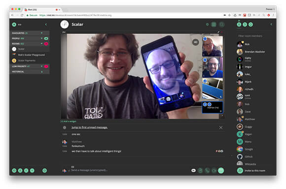

---

## 📂 BitTorrent

### 36. qBittorrent

> q Bittorrent is a free and open-source Bit Torrent client that helps users to download and share files over the network in a decentralized manner.

🔗 [qBittorrent](https://www.qbittorrent.org/) | [BitTorrent client](https://www.tecmint.com/download-managers-for-linux/)

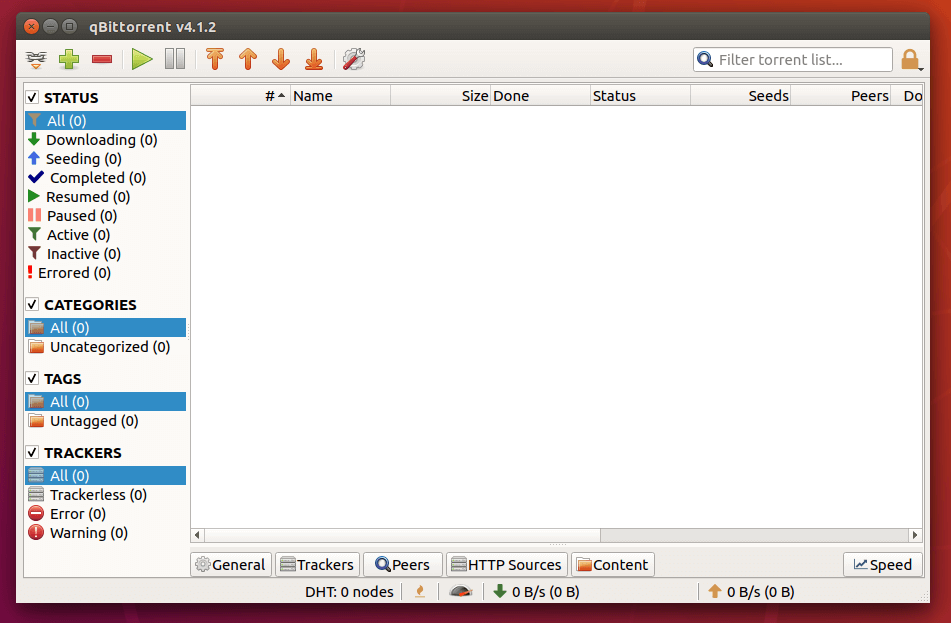

---

## 📂 Remote Access

### 37. FreeRDP

> If your system administration tasks include managing Windows servers via Remote Desktop Protocol (RDP), FreeRDP is a tool that you will want to try ou.

🔗 [system administration tasks](https://www.tecmint.com/linux-sed-command-tips-tricks/) | [Windows servers via Remote Desktop Protocol](https://www.tecmint.com/manage-samba4-ad-from-windows-via-rsat/) | [FreeRDP](http://www.freerdp.com)

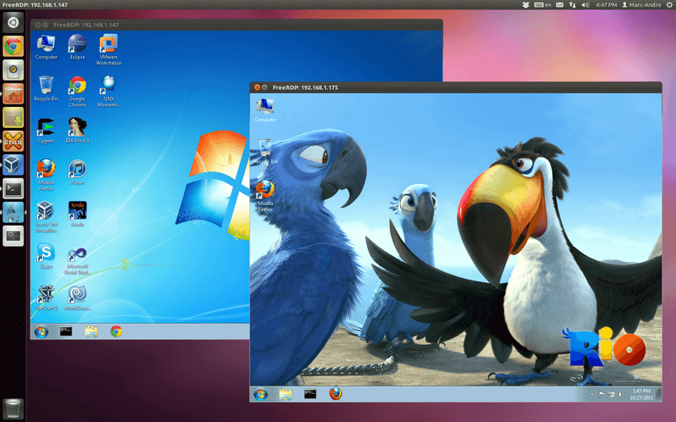

---

## 📂 Security

### 38. Security Onion

> Security Onion is a Linux distribution designed specifically for network security monitoring, intrusion detection, and threat hunting for a small busi.

🔗 [Security Onion](https://securityonionsolutions.com/)

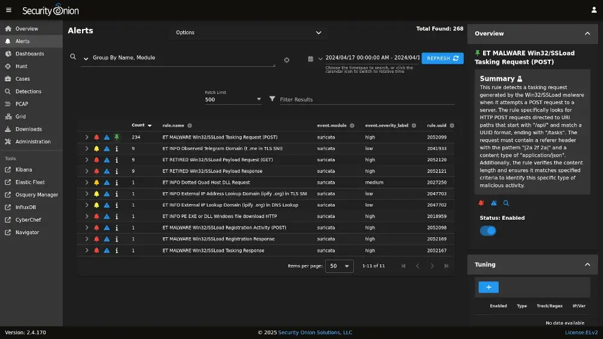

---

## 📂 Network Monitoring

### 39. OpenNMS

> If you manage a network with multiple devices, servers, or services, OpenNMS is a lifesaver, as it is a free and open-source enterprise-grade network .

🔗 [OpenNMS](https://www.opennms.com/)

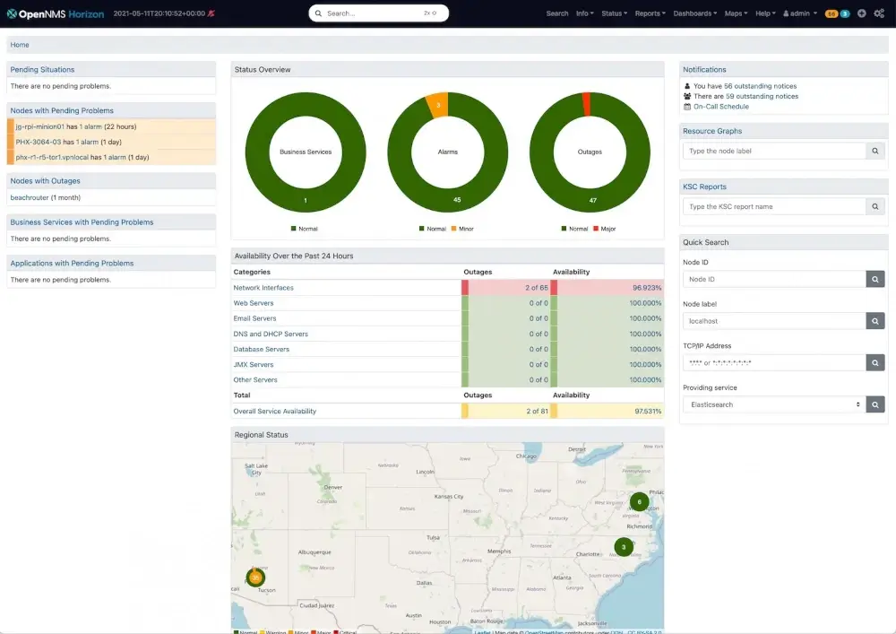

---

## 📂 IT Asset Management

### 40. OCS Inventory NG

> Open Computer and Software Inventory Next Generation, or OCS Inventory NG for short, is a lightweight web application that can help network and system.

🔗 [OCS Inventory NG](https://ocsinventory-ng.org/)

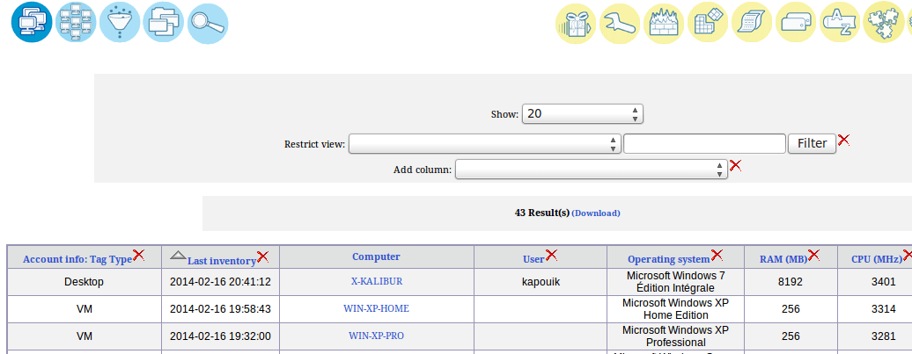

---

### 41. GLPI

> Often used alongside OCS Inventory NG , GLPI is a powerful, multilingual IT asset management tool that helps you keep a complete inventory of your net.

🔗 [GLPI](https://glpi-project.org/) | [Install GLPI IT and Asset Management Tool in Linux](https://www.tecmint.com/install-glpi-asset-management-rhel/)

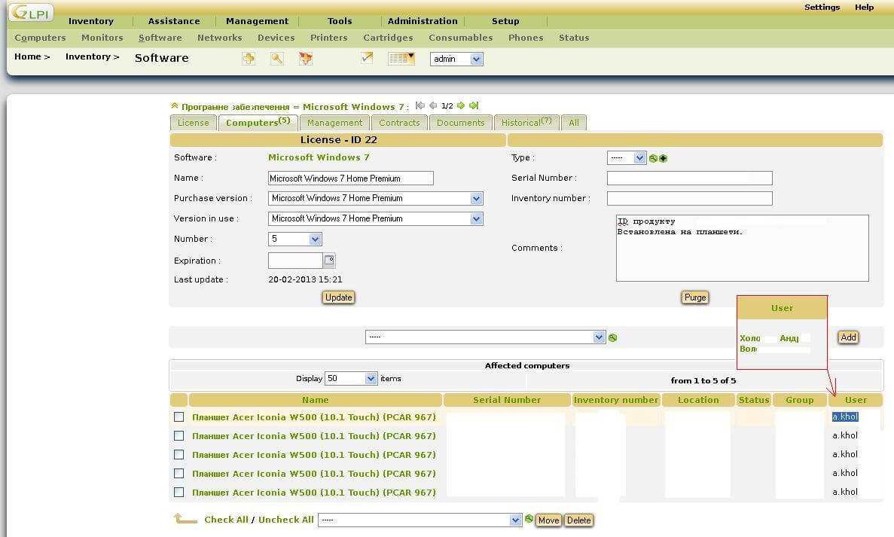

---

## 📂 Cloud & File Sync

### 42. NextCloud

> Described as “a safe home for all your data”, Next Cloud was started as a separate project by one of its own Cloud’s first collaborators.

🔗 [NextCloud](https://nextcloud.com) | [ownCloud](https://www.tecmint.com/install-owncloud-to-create-personal-storage-in-linux/) | [office documents](https://www.tecmint.com/work-with-documents-in-nextcloud/)

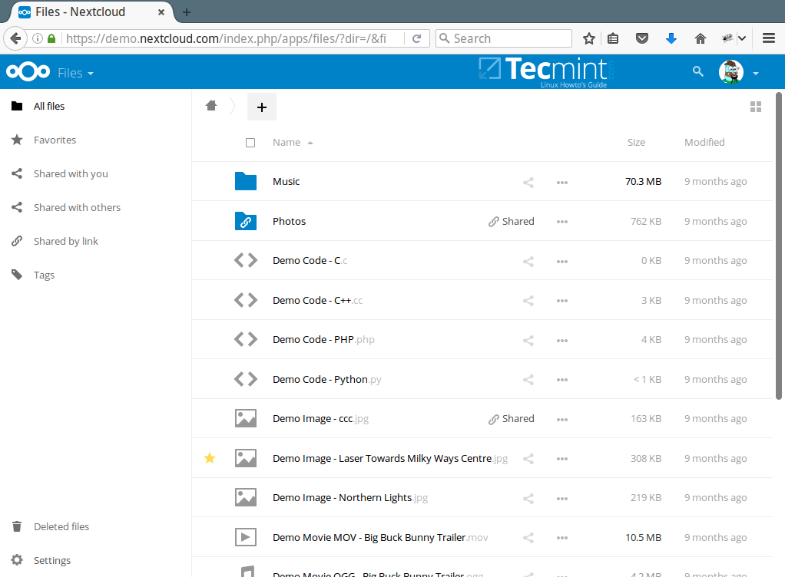

---

### 43. Owncloud

> Although not a new kid on the block in any way, I chose to include Own Cloud in this review due to its importance.

🔗 [OwnCloud](https://www.owncloud.com) | [Dropbox](https://www.tecmint.com/install-dropbox-in-linux/) | [Create Personal/Private Cloud Storage Solution in Linux](https://www.tecmint.com/install-owncloud-to-create-personal-storage-in-linux/)

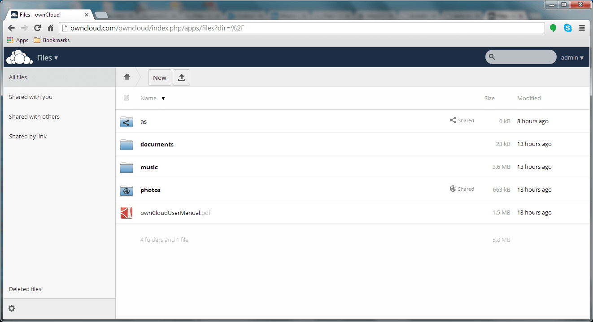

---

### 44. Internxt

> Secure Cloud Storage

🔗 [Internxt](https://www.tecmint.com/go/internxt)

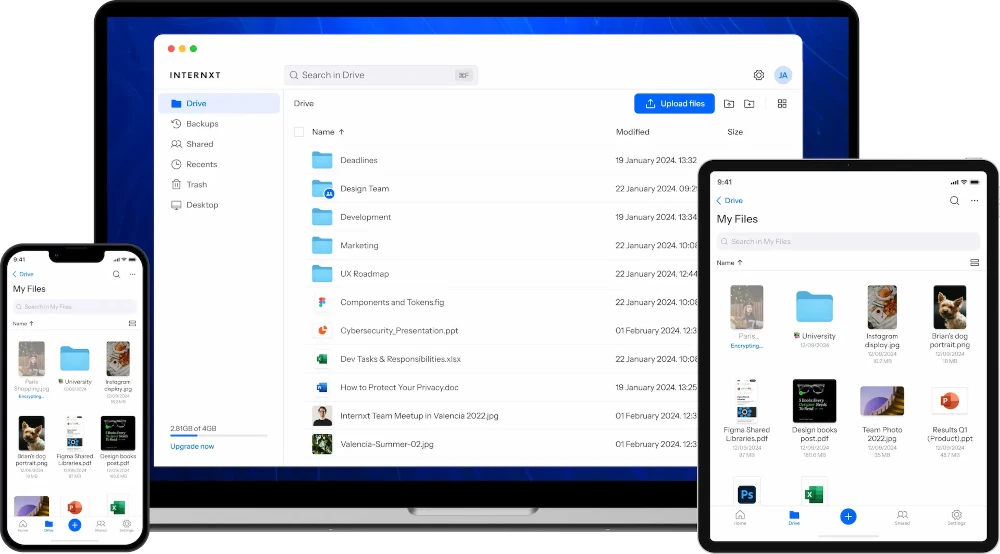

---

## 📂 Audio & Music

### 45. Ampache

> With Ampache , you can set up your own home media center or online audio and video streaming application and access it from anywhere with an Internet .

🔗 [Ampache](https://ampache.org/) | [online audio and video streaming](https://www.tecmint.com/home-media-streaming-server-using-plex-with-freenas/)

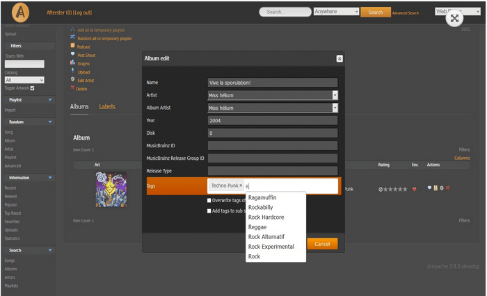

---

## 📂 Office & Productivity

### 46. ONLYOFFICE

> Many Linux users have been lacking a decent Microsoft Office alternative for years.

🔗 [Microsoft Office alternative](https://www.tecmint.com/microsoft-office-alternatives-for-linux/) | [ONLYOFFICE](https://www.onlyoffice.com/) | [free desktop editor](https://www.tecmint.com/install-onlyoffice-desktop-editors-in-linux/) | [fillable forms](https://www.tecmint.com/create-fillable-pdf-forms-linux-onlyoffice/) | [Nextcloud](https://www.tecmint.com/co-author-documents-with-onlyoffice/) | [Moodle](https://www.tecmint.com/elearning-moodle-onlyoffice-ubuntu/) | [WordPress](https://www.tecmint.com/integrate-onlyoffice-in-wordpress/) | [Seafile](https://www.tecmint.com/create-file-sharing-onlyoffice-docs-seafile/)

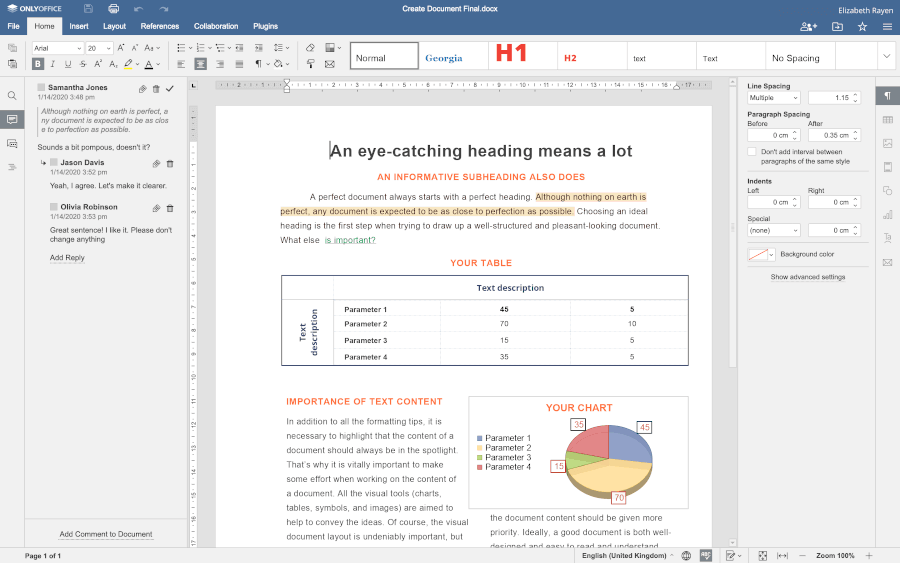

---

### 47. Thunderbird

> Thunderbird is an open-source email client that brings all your messages, calendars, and contacts into a single, easy-to-use interface.

🔗 [Thunderbird](https://www.thunderbird.net/en-US/)

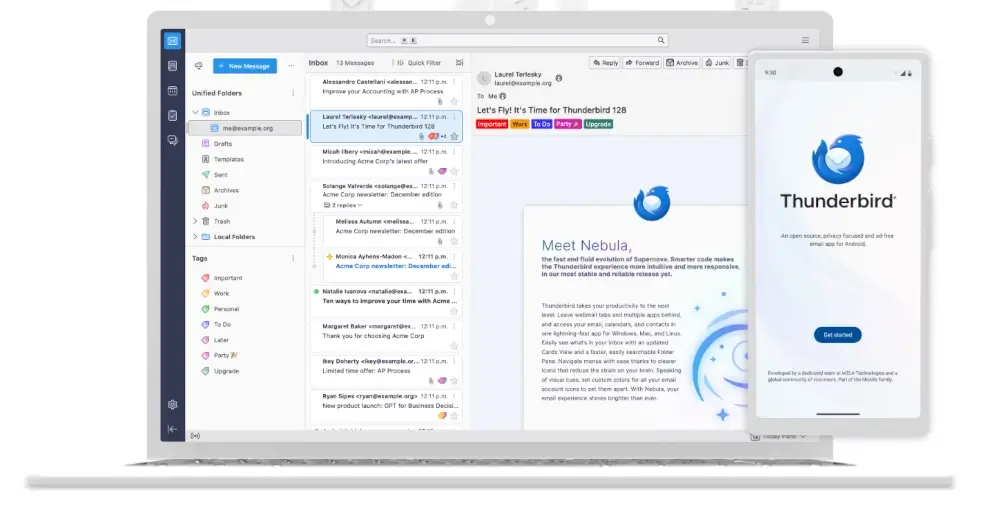

---

## 📂 Email

### 48. Mailspring

> When it comes to email management, one of my favorite tools is Mailspring , which is an open-source and cross-platform email client that allows you to.

🔗 [Mailspring](https://getmailspring.com/)

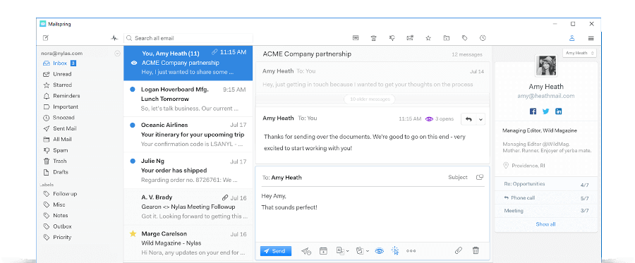

---

## 📂 Office & Productivity

### 49. OpenTodoList

> If you work on several projects and have a lot of tasks to do at a time, you definitely need to try Open Todo List , which is a simple note-taking appli.

🔗 [OpenTodoList](https://opentodolist.rpdev.net/)

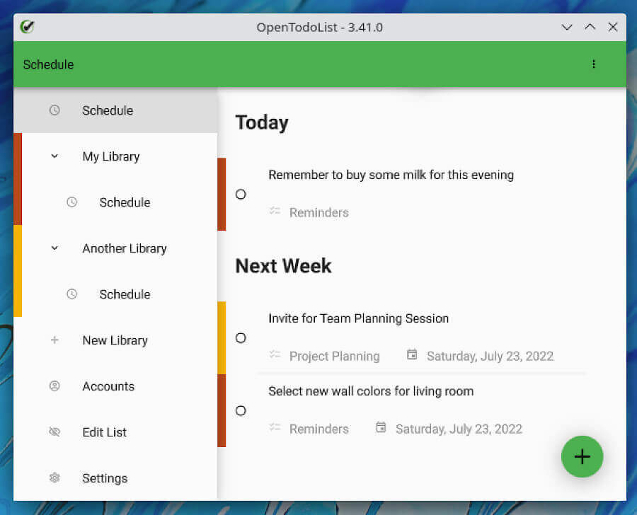

---

## 📂 Finance & ERP

### 50. GNUCash

> If you have been using a spreadsheet to keep track of your personal, family, or business finances, it may be time to try a more suitable solution, suc.

🔗 [GNUCash](https://www.gnucash.org/) | [GNUCash](https://www.tecmint.com/gnucash-financial-accounting-tool-to-track-expenses-in-linux/)

---

## 📂 Document Management

### 51. LogicalDOC

> Both available as Enterprise (paid) and Community editions, LogicalDOC is an award-winning, web-based Document Management System (DMS).

🔗 [LogicalDOC](https://www.logicaldoc.us/en-us/)

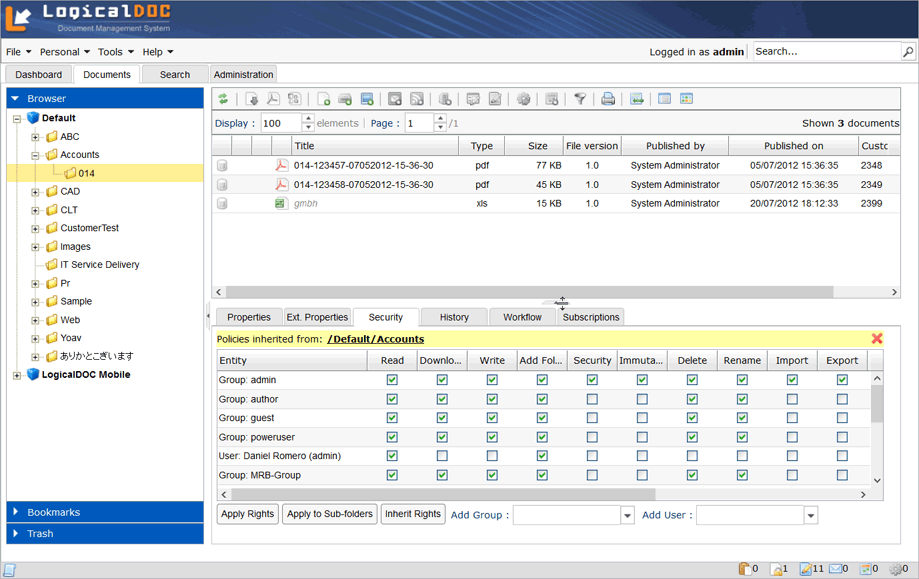

---

## 📂 Reporting & BI

### 52. Jaspersoft Studio

> Jaspersoft Studio is a report designer program that allows you to create simple and sophisticated reports, as well as charts, tabs, tables (and everyt.

🔗 [Jaspersoft Studio](https://community.jaspersoft.com/)

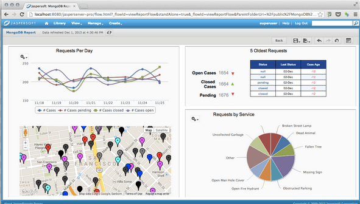

---

## 📂 Finance & ERP

### 53. GNU Health

> GNU Health is a free, extremely scalable Health and Hospital Information Platform, which is used by health professionals across the world to enhance t.

🔗 [GNU Health](https://www.gnuhealth.org)

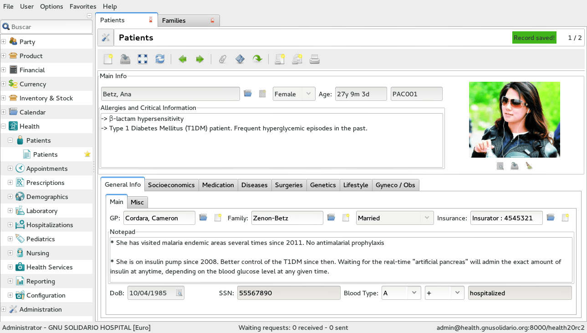

---

## 📂 Office & Productivity

### 54. Cherrytree

> Cherrytree is a free and open-source hierarchical note-taking program that comes with rich text formatting, syntax highlighting, and advanced customiz.

🔗 [Cherrytree](https://github.com/giuspen/cherrytree)

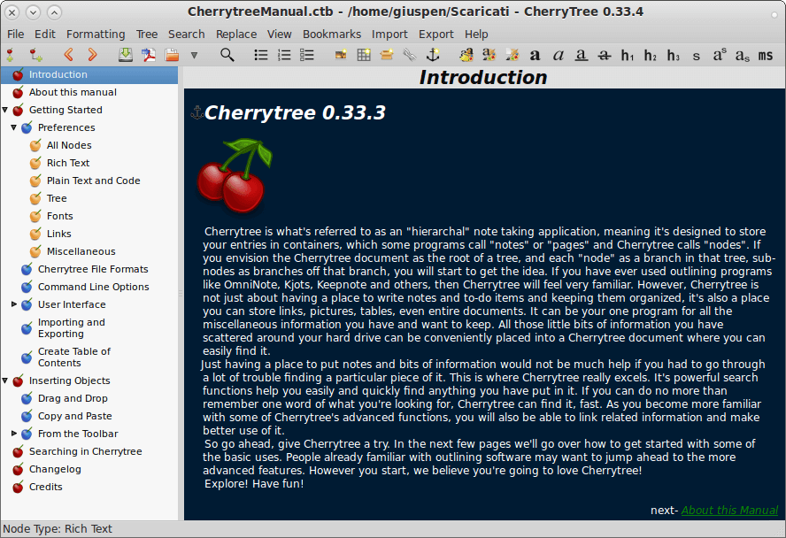

---

## 📂 System & Backup

### 55. Timeshift

> Timeshift is a system backup and restore tool that works like Windows System Restore or macOS Time Machine , protecting your Linux system by taking in.

🔗 [Timeshift](https://github.com/linuxmint/timeshift) | [RSYNC](https://www.tecmint.com/linux-rsync-incremental-backup-cron/)

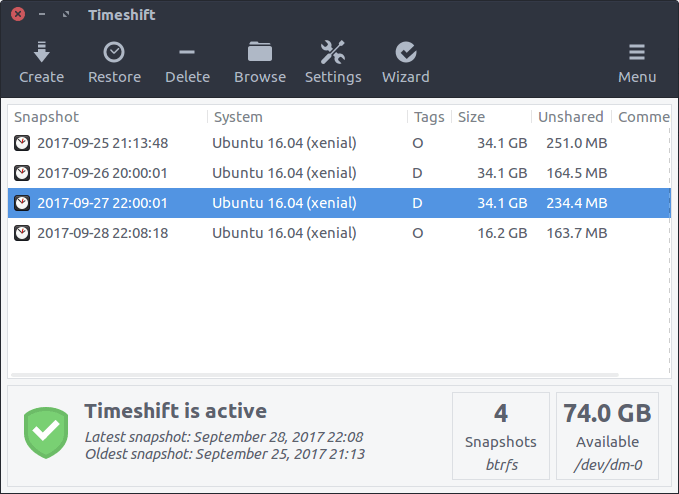

---

## 📂 Other

### 56. DocumentDB

> If you’re a developer or someone who manages data regularly, DocumentDB is an open-source database that combines the flexibility of NoSQL with the rel.

🔗 [DocumentDB](https://documentdb.io/)

---

### 57. OpenHPC

> OpenHPC is a collection of open-source tools and libraries that make it easier to build and manage high-performance computing (HPC) clusters on Linux.

🔗 [OpenHPC](https://openhpc.community/)

---

## 📂 Note-taking & Wiki

### 58. MediaWiki

> Media Wiki is a program for creating and managing a Wikipedia-like website (in fact, Wikipedia itself is based on Media Wiki) where a community can add,.

🔗 [MediaWiki](https://www.mediawiki.org/wiki/MediaWiki)

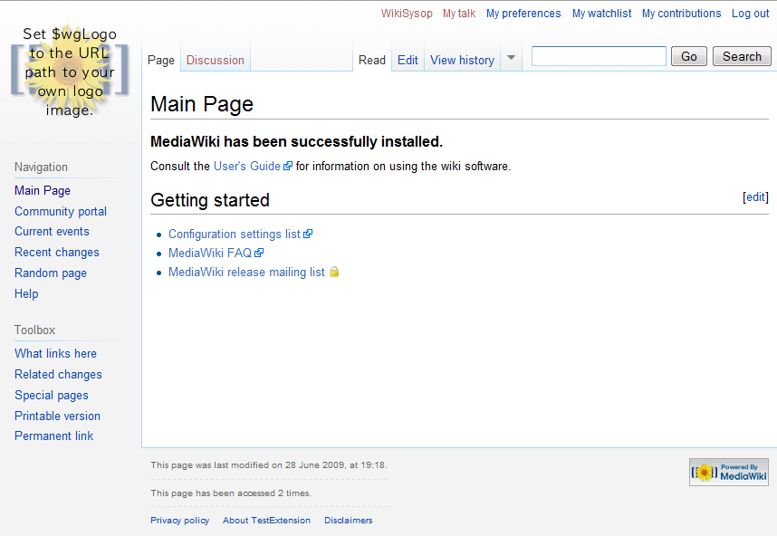

---

## 📂 Bug Tracking

### 59. Flyspray

> Again, I may be a little biased on this one.

🔗 [Flyspray](https://github.com/flyspray/flyspray)

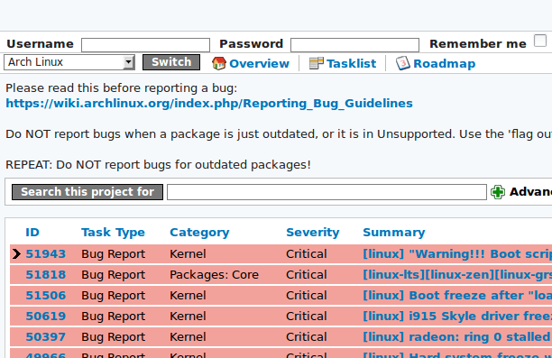

---

## 📂 Other

### 60. Odoo POS

> Odoo POS is a free and open-source solution that integrates seamlessly with the rest of the Odoo ecosystem, allowing you to manage sales, inventory, a.

🔗 [Odoo POS](https://www.odoo.com/app/point-of-sale-shop) | [Pro.Tecmint.com](https://pro.tecmint.com) | [How to Install LAMP Stack with PHP 8.3 and MariaDB 11 on Ubuntu 24.04](https://www.tecmint.com/install-lamp-stack-ubuntu/) | [7 Best Tools to Monitor and Debug Disk I/O Performance in Linux](https://www.tecmint.com/monitor-linux-disk-io-performance/) | [TecMint Weekly Newsletter](https://newsletter.tecmint.com/subscription?f=hj6Ohm9gck3Z0PQ2BBBTh892iaCbDV3jJJa3hD8ULUlubOgnbo8aF44vt2HZfdc36g)

---
